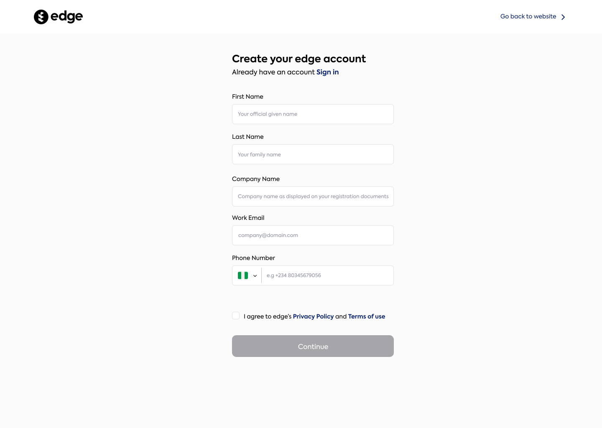

## Getting Started with EDGE API

The first step to integrating with the EDGE API is setting up your account and understanding how to obtain your API credentials. This ensures you can securely and efficiently interact with our platform.

<CardGroup cols={1}>
  <Card title="Sign Up for an Account" icon="user-plus">
    Begin by registering your account to start using the EDGE API. Follow the simple sign-up process.

    1\. **Visit the Sign-Up Page:**
   - Go to [Edge Signup Page](https://app.withedge.co/) and click on the **Sign Up** button to start the registration process.

    2\. **Fill Out the Registration Form:**

   - **First Name:** Enter your official given name. This field accepts letters from A to Z and hyphens (-), with no special characters or spaces allowed.
   - **Last Name:** Enter your family name, following the same character restrictions as the First Name.
   - **Company Name:** Provide the name of your company as it appears on your registration documents.
   - **Email:** Enter a valid company email address (e.g., company@domain.com).
   - **Phone Number:** Select your country from the dropdown, which will automatically add the country code. Then enter your phone number without the leading zero '0' or country code.

  </Card>

  </CardGroup>

   

  <CardGroup cols={1}>
  <Card title="Verify Your Email" icon="envelope-open-text" href="https://withedge.co/">
    Check your email to activate your account and set your password. Make sure to check your Spam folder if you don't see it.
  </Card>
</CardGroup>

## Manage Your API Credentials

Once your account is active, the next step is to obtain and manage your API credentials, which are crucial for authenticating requests to the EDGE API.

<CardGroup cols={2}>
  <Card title="Access API Credentials" icon="key" href="https://build.withedge.co/settings">
    Navigate to the account settings page on the dashboard to access and manage your API credentials.
  </Card>
  <Card title="Secure Your Keys" icon="shield-alt" href="https://build.withedge.co/security">
    Learn our best practices  recommendation for securing your API keys and ensuring your integrations are safe.
  </Card>
</CardGroup>

### Important Details to Remember

- **API Usage:** Familiarize yourself with how to use your API credentials to make authenticated requests.
- **Compliance:** Ensure your use of the API complies with our guidelines and terms of service to prevent any interruptions or restrictions.

#### Summary

Setting up your EDGE API access involves a clear process from account registration to obtaining your API credentials. By following these steps and utilizing the resources provided, you will be well-prepared to integrate and utilize the EDGE API effectively in your applications.
